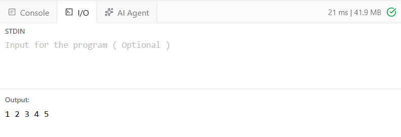

# Flattening a Nested List Using an Iterator
## DATE: 16-09-2026
## AIM:
To design and implement a class NestedIterator that flattens a nested list of integers such that all integers can be accessed sequentially using an iterator interface (next() and hasNext()).
## Algorithm
1. Create a NestedInteger interface that can represent either a single integer or a nested list.
2. Create the NestedIterator class implementing the Iterator<Integer> interface.
3. Use a stack to store nested elements and process them from left to right.
4. In hasNext(), check the top element of the stack.
5. If the top element is a list, remove it and push its elements onto the stack in reverse order.
6. Continue until the top element becomes a single integer or the stack becomes empty.
7. In next(), call hasNext() and then remove and return the top integer.
8. Use hasNext() before next() to access all integers sequentially.

## Program:
```
/*
Program to find Flattening a Nested List Using an Iterator
Developed by: Elavarasan M
RegisterNumber: 212224040083 
*/
```

```java
import java.util.*;

public class NestedIterator implements Iterator<Integer> {

    interface NestedInteger {
        boolean isInteger();
        Integer getInteger();
        List<NestedInteger> getList();
    }

    // Simple implementation of NestedInteger
    static class NI implements NestedInteger {
        Integer value;
        List<NestedInteger> list;

        NI(int value) {
            this.value = value;
        }

        NI(List<NestedInteger> list) {
            this.list = list;
        }

        public boolean isInteger() {
            return value != null;
        }

        public Integer getInteger() {
            return value;
        }

        public List<NestedInteger> getList() {
            return list;
        }
    }

    Stack<NestedInteger> stack = new Stack<>();

    public NestedIterator(List<NestedInteger> nestedList) {

        for (int i = nestedList.size() - 1; i >= 0; i--) {
            stack.push(nestedList.get(i));
        }
    }

    @Override
    public boolean hasNext() {

        while (!stack.isEmpty()) {

            NestedInteger current = stack.peek();

            if (current.isInteger()) {
                return true;
            }

            stack.pop();

            List<NestedInteger> list = current.getList();

            for (int i = list.size() - 1; i >= 0; i--) {
                stack.push(list.get(i));
            }
        }

        return false;
    }

    @Override
    public Integer next() {

        if (!hasNext()) {
            throw new NoSuchElementException();
        }

        return stack.pop().getInteger();
    }

    // Main method
    public static void main(String[] args) {

        List<NestedInteger> list = new ArrayList<>();

        list.add(new NI(1));

        List<NestedInteger> inner = new ArrayList<>();
        inner.add(new NI(2));

        List<NestedInteger> inner2 = new ArrayList<>();
        inner2.add(new NI(3));
        inner2.add(new NI(4));

        inner.add(new NI(inner2));

        list.add(new NI(inner));
        list.add(new NI(5));

        NestedIterator iterator = new NestedIterator(list);

        while (iterator.hasNext()) {
            System.out.print(iterator.next() + " ");
        }
    }
}
```
## Output:



## Result:
The NestedIterator class successfully flattens a nested list of integers into a single list and provides sequential access using standard iterator methods.
