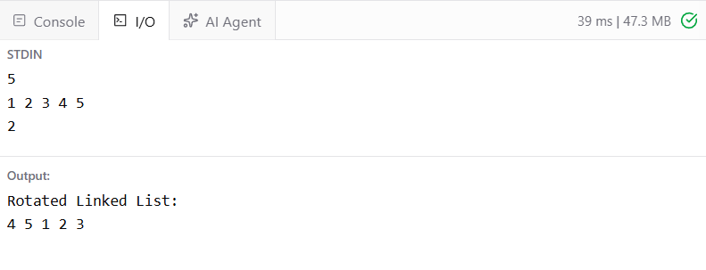

# Ex6 Right Rotation LinkedList
## DATE: 16-09-2026
## AIM:
To write a Java  program to: Create a singly linked list.Rotate the linked list to the right by k positions.Display the rotated linked list.

## Algorithm
1. Start the program.
2. Create a `Node` class with two fields:

   * `data` → stores the element.
   * `next` → stores the reference to the next node.
3. Create a `LinkedListRotation` class to manage the linked list.
4. Insert elements into the linked list.
5. Read the value of `k`, which represents the number of right rotations.
6. Rotate the list right by `k` positions:

   1. Find the length of the linked list.
   2. Connect the last node to the head to make the list circular.
   3. Find the new head after `length - (k % length)` steps.
   4. Break the circular link after the new tail node.
7. Display the final rotated linked list.
8. Stop the program.


## Program:
```
/*
Program to  Right Rotation LinkedList
Developed by:Elavarasan M 
RegisterNumber: 212224040083  
*/
```

```java
import java.util.Scanner;
public class RotateLinkedList {
    public static Node rotate(Node head, int k) {
       if (head==null || head.next == null || k==0)return head;
       
       int length = 1;
       Node tail = head;
       while(tail.next != null){
           tail  =tail.next;
           length++;
        }
        
        k = k%length;
        if (k==0) return head;
        
        int steps = length-k;
        Node newTail = head;
        for (int i=1; i<steps; i++){
            newTail = newTail.next;
        }
        
        Node newHead = newTail.next;
        newTail.next = null;
        tail.next = head;
        
        return newHead;
       
    }
    public static void display(Node head) {
        Node current = head;
        System.out.print("LinkedList: ");
        while (current != null) {
            System.out.print(current.data + " ");
            current = current.next;
        }
        System.out.println();
    }
    public static void main(String[] args) {
        Scanner scanner = new Scanner(System.in);
        Node head = null, tail = null;
        int n = scanner.nextInt();
        for (int i = 0; i < n; i++) {
            Node newNode = new Node(scanner.nextInt());
            if (head == null) {
                head = tail = newNode;
            } else {
                tail.next = newNode;
                tail = newNode;
            }
        }
        int k = scanner.nextInt();
        head = rotate(head, k);
        display(head);
        scanner.close();
    }
}
class Node {
    int data;
    Node next;
    Node(int data) {
        this.data = data;
        this.next = null;
    }
}

```
## Output:



## Result:
Thus, the Java program to perfom right rotation on linked list is implemented successfully.
