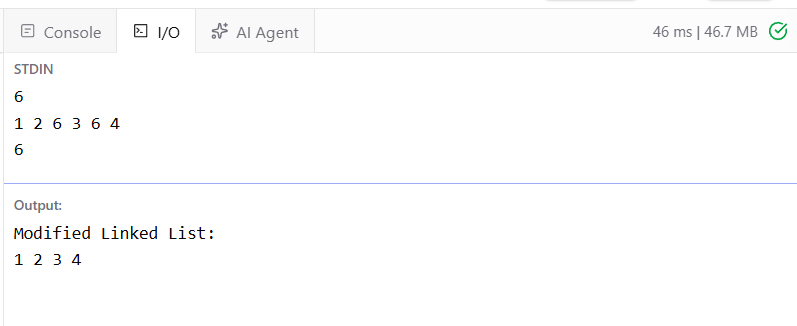

# Ex7 Removal of Nodes with a Specific Value from a Linked List
## DATE: 16-09-2026
## AIM:
To write a java  program that removes all nodes from a linked list whose value matches a given integer (val) and returns the new head of the modified linked list.

## Algorithm
1. Create a singly linked list with the given elements.
2. Read the integer value val that needs to be removed.
3. Check the nodes at the beginning of the list.
4. If the head node contains val, move the head to the next node.
5. Traverse the remaining linked list using a temporary pointer.
6. If the next node contains val, skip that node by changing the next link.
7. Continue until the end of the list is reached.
8. Return and display the new head of the modified linked list.

## Program:
```
/*
program that removes all nodes from a linked list whose value matches a given integer (val) and returns the new head of the modified linked list.
Developed by: Elavarasan M
RegisterNumber: 212224040083 
*/
```

```java
import java.util.*;

public class RemoveElements {

    static class Node {
        int data;
        Node next;

        Node(int data) {
            this.data = data;
            this.next = null;
        }
    }

    static Node insert(Node head, int data) {

        Node newNode = new Node(data);

        if (head == null) {
            return newNode;
        }

        Node temp = head;

        while (temp.next != null) {
            temp = temp.next;
        }

        temp.next = newNode;

        return head;
    }

    static Node removeElements(Node head, int val) {

        // Remove matching nodes from the beginning
        while (head != null && head.data == val) {
            head = head.next;
        }

        // Remove matching nodes from the remaining list
        Node temp = head;

        while (temp != null && temp.next != null) {

            if (temp.next.data == val) {
                temp.next = temp.next.next;
            } else {
                temp = temp.next;
            }
        }

        return head;
    }

    static void display(Node head) {

        Node temp = head;

        while (temp != null) {
            System.out.print(temp.data + " ");
            temp = temp.next;
        }

        System.out.println();
    }

    public static void main(String[] args) {

        Scanner sc = new Scanner(System.in);

        int n = sc.nextInt();

        Node head = null;

        for (int i = 0; i < n; i++) {
            int data = sc.nextInt();
            head = insert(head, data);
        }

        int val = sc.nextInt();

        head = removeElements(head, val);

        System.out.println("Modified Linked List:");
        display(head);
    }
}
```
## Output:



## Result:
The java program successfully removes all nodes with the specified value (val) from the linked list and returns the new head.
