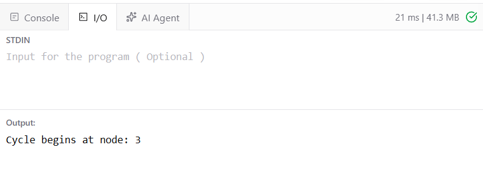

# Ex8 Detection of Cycle and Finding the Starting Node in a Linked List
## DATE: 16-09-2026
## AIM:
To write a program that detects a cycle in a linked list and returns the node where the cycle begins.If there is no cycle, the program should return null without modifying the linked list.
## Algorithm
1. Create two pointers, slow and fast, both initially pointing to the head.
2. Move slow one node at a time and fast two nodes at a time.
3. If fast or fast.next becomes null, there is no cycle; return null.
4. If slow and fast meet, a cycle exists in the linked list.
5. Move slow back to the head while keeping fast at the meeting point.
6. Move both pointers one node at a time.
7. The point where they meet again is the starting node of the cycle.
8. Return that node without modifying the linked list.   

## Program:
```
/*
program that detects a cycle in a linked list and returns the node where the cycle begins.
If there is no cycle, the program should return null without modifying the linked list.
Developed by: Elavarasan M
RegisterNumber: 212224040083 
*/
```

```java
import java.util.*;

public class DetectCycle {

    static class Node {
        int data;
        Node next;

        Node(int data) {
            this.data = data;
            this.next = null;
        }
    }

    static Node detectCycle(Node head) {

        Node slow = head;
        Node fast = head;

        // Find whether a cycle exists
        while (fast != null && fast.next != null) {

            slow = slow.next;
            fast = fast.next.next;

            if (slow == fast) {
                break;
            }
        }

        // No cycle
        if (fast == null || fast.next == null) {
            return null;
        }

        // Find the starting node of the cycle
        slow = head;

        while (slow != fast) {
            slow = slow.next;
            fast = fast.next;
        }

        return slow;
    }

    public static void main(String[] args) {

        Node head = new Node(1);
        head.next = new Node(2);
        head.next.next = new Node(3);
        head.next.next.next = new Node(4);
        head.next.next.next.next = new Node(5);

        // Creating a cycle: 5 -> 3
        head.next.next.next.next.next = head.next.next;

        Node cycleStart = detectCycle(head);

        if (cycleStart != null) {
            System.out.println("Cycle begins at node: " + cycleStart.data);
        } else {
            System.out.println("No cycle");
        }
    }
}
```

## Output:



## Result:
The program successfully detects whether a cycle exists in the linked list.
If a cycle is present, it correctly identifies and returns the node where the cycle begins.
