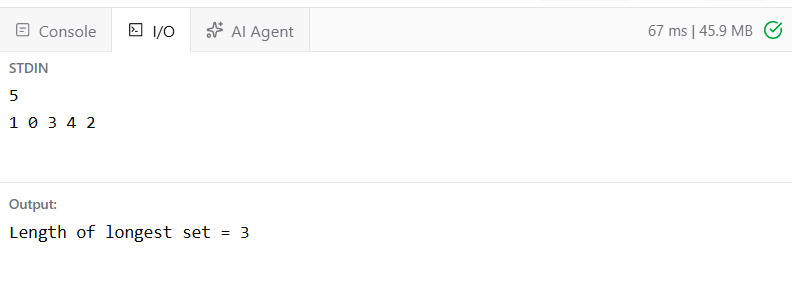

# Ex9 Finding the Longest Length of Nested Set in a Permutation Array
## DATE: 16-09-2026
## AIM:
To write a program that finds the length of the longest set s[k] defined as s[k] = { nums[k], nums[nums[k]], nums[nums[nums[k]]], … },where the iteration stops before a duplicate element occurs.

The task is to return the maximum size among all such sets.
## Algorithm
1. Read the array nums of size n.
2. Initialize maxLength = 0 to store the longest set length.
3. For each index k, create a visited array to keep track of elements already included in the current set.
4. Start with current = k and repeatedly set current = nums[current].
5. Stop when the current element has already been visited.
6. Count the number of elements visited during this process.
7. Update maxLength if the current set length is greater.
8. Display maxLength as the length of the longest set. 

## Program:
```
/*
Program to find the Longest Length of Nested Set in a Permutation Array
Developed by: Elavarasan M
RegisterNumber: 212224040083 
*/
```
```java
import java.util.*;

public class LongestSet {

    public static int longestSet(int[] nums) {

        int n = nums.length;
        int maxLength = 0;

        for (int k = 0; k < n; k++) {

            boolean[] visited = new boolean[n];
            int current = k;
            int length = 0;

            while (!visited[current]) {

                visited[current] = true;
                length++;

                current = nums[current];
            }

            maxLength = Math.max(maxLength, length);
        }

        return maxLength;
    }

    public static void main(String[] args) {

        Scanner sc = new Scanner(System.in);

        int n = sc.nextInt();

        int[] nums = new int[n];

        for (int i = 0; i < n; i++) {
            nums[i] = sc.nextInt();
        }

        int result = longestSet(nums);

        System.out.println("Length of longest set = " + result);
    }
}
```
## Output:




## Result:
The program successfully computes the longest length of the nested set s[k] for the given permutation array.
